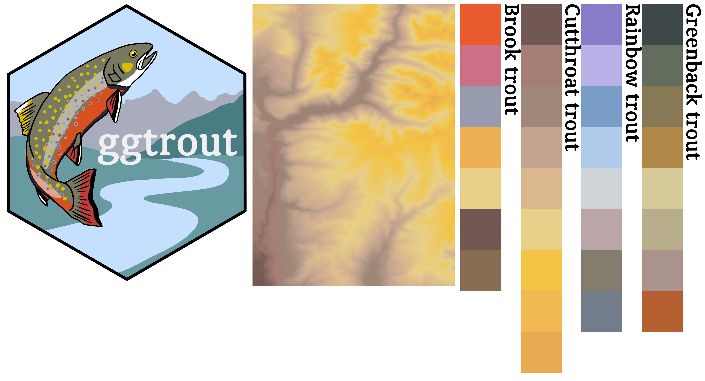
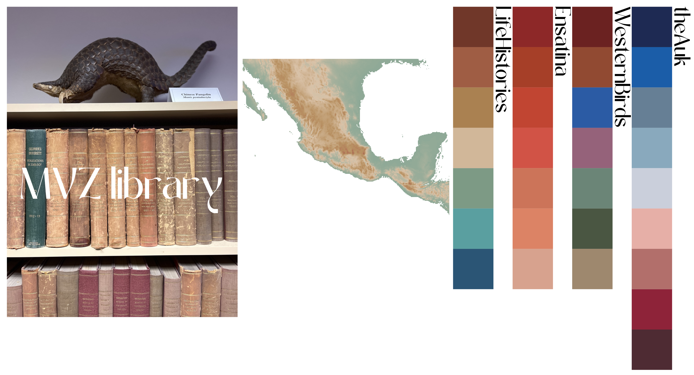
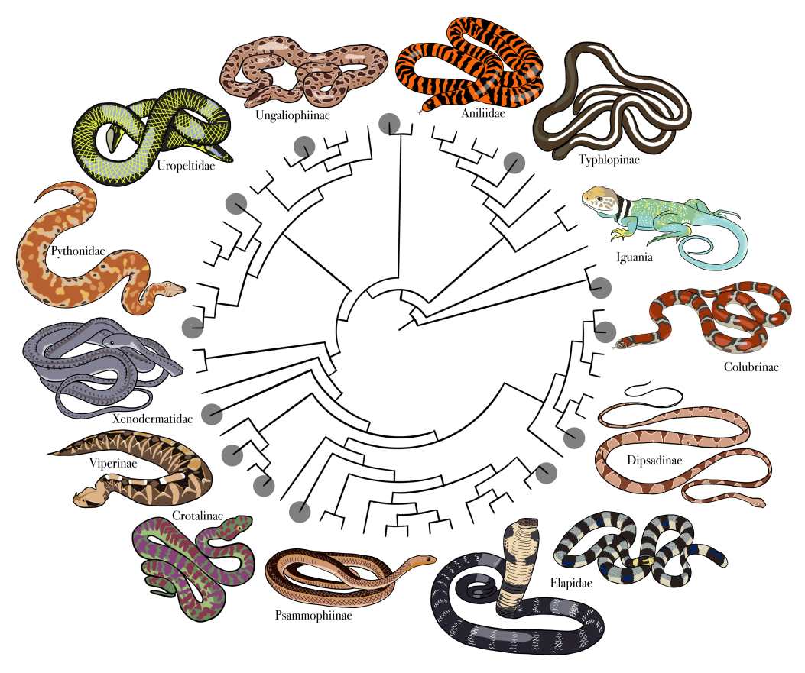
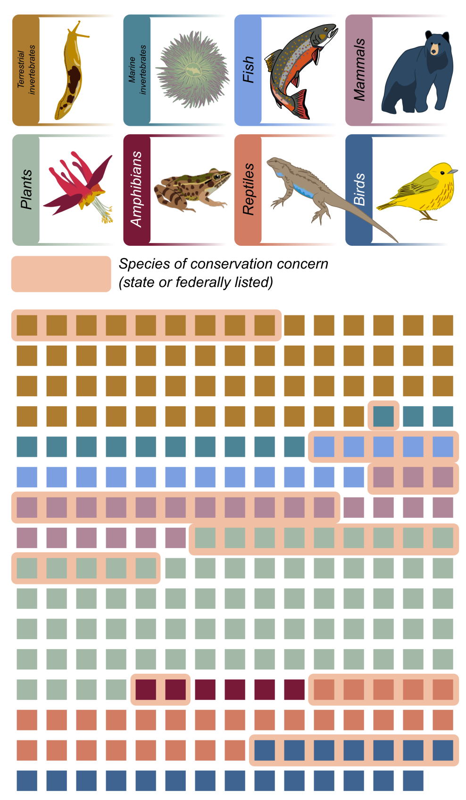
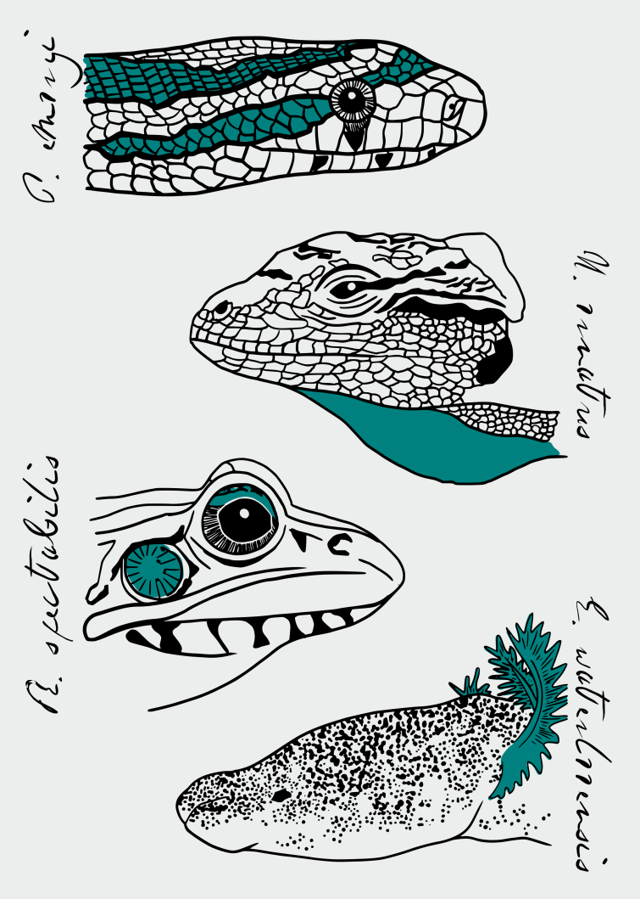
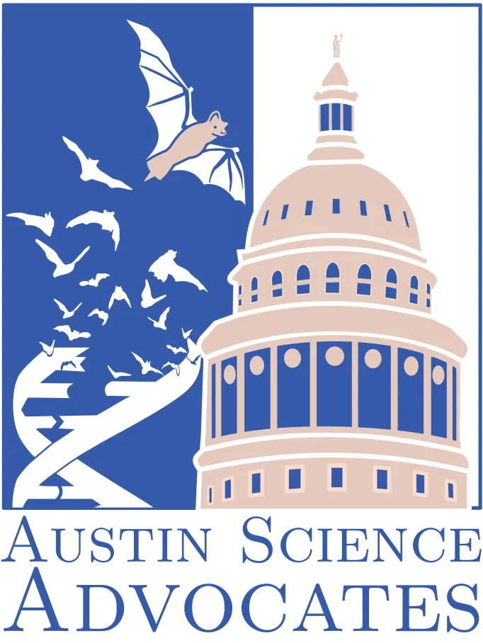
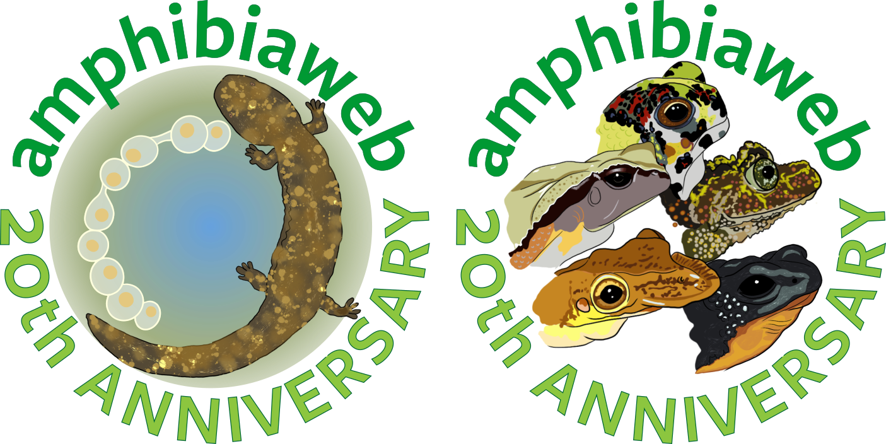
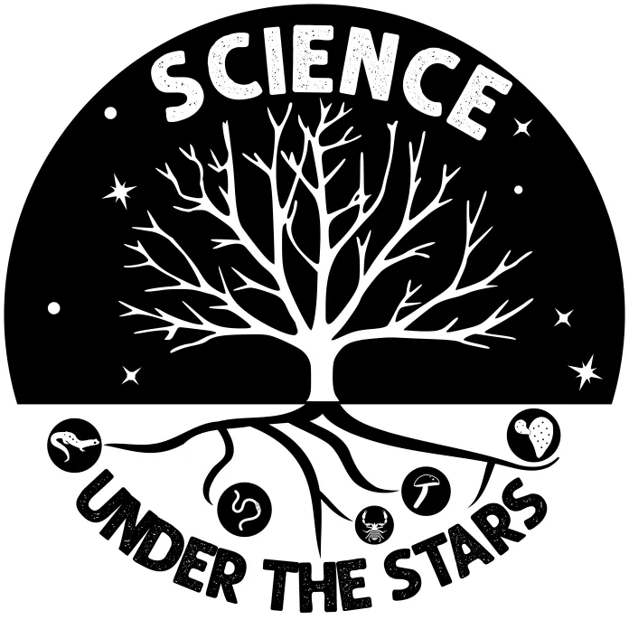

<header class="interior-header">
<div class="interior-header-inner">

<a class="interior-logo" href="index.html">

</a>

<nav class="interior-nav">
<a href="research.html">Research</a>
<a href="publications.html">Publications</a>
<a href="people.html">People</a>
<a href="opportunities.html">Opportunities</a>
<a class="active" href="art.html">Art</a>
</nav>

</div>
</header>


<main class="research-page">

<section class="research-intro">

<div class="research-page-title">Art</div>

</section>

```{=html}
<div class="art-grid">

<a class="art-item" href="images/art/ggtrout_palettes.png">

  

  <div class="art-overlay">
    <div class="art-title">ggtrout</div>
    <div class="art-meta">R color palette package</div>
    <div class="art-description">
      R color palette inspired by trout coloration.
    </div>
  </div>

</a>

<a class="art-item" href="images/art/mvzlibrary_palettes.png">

  

  <div class="art-overlay">
    <div class="art-title">MVZlibrary</div>
    <div class="art-meta">R color palette package</div>
    <div class="art-description">
      R color palette inspired by the colors of book spines at the Museum of Vertebrate Zoology’s library.
    </div>
  </div>

</a>

<a class="art-item" href="images/art/snaketree.png">

  Snake family tree">

  <div class="art-overlay">
    <div class="art-title">Snake family tree</div>
    <div class="art-description">
      Snake cladogram with representatives from indicated subfamilies.
    </div>
  </div>

</a>

<a class="art-item" href="images/art/ccgp_species-1.png">

  

  <div class="art-overlay">
    <div class="art-title">CCGP taxa</div>
    <div class="art-description">
      Summary of the taxa included in the California Conservation Genomics Project.
    </div>
  </div>

</a>

<a class="art-item" href="images/art/hillis_lab_back.png">

  

  <div class="art-overlay">
    <div class="art-title">Hillis lab t-shirt design</div>
  </div>

</a>

<a class="art-item" href="images/art/asa_otherlogo.png">

  

  <div class="art-overlay">
    <div class="art-title">Logo design</div>
    <div class="art-description">
      Logo designed for the Austin Science Advocates.
    </div>
  </div>

</a>

<a class="art-item" href="images/art/amphibiaweb.png">

  

  <div class="art-overlay">
    <div class="art-title">AmphibiaWeb illustrations</div>
    <div class="art-description">
      Winning designs for “Art your Amphibian”, which celebrated the 20th anniversary of AmphibiaWeb.
    </div>
  </div>

</a>

<a class="art-item" href="images/art/suts_logo.png">

  

  <div class="art-overlay">
    <div class="art-title">Logo design</div>
    <div class="art-description">
      Logo designed for Science Under the Stars public outreach program in Austin, TX.
    </div>
  </div>

</a>

<a class="art-item" href="images/art/epi_illustrated.png">

  

  <div class="art-overlay">
    <div class="art-title">Epipedobates</div>
    <div class="art-description">
      Three Epipedobates species.
    </div>
  </div>

</a>

</div>
```

</main>


<footer class="site-footer">
<div class="footer-inner">

<div class="footer-links">
<a href="https://github.com/eachambers">GitHub</a>
<a href="https://scholar.google.com/citations?user=WmEPfsMAAAAJ&hl=en">Google Scholar</a>
<a href="https://bsky.app/profile/chamberea.bsky.social">Bluesky</a>
</div>

</div>
</footer>