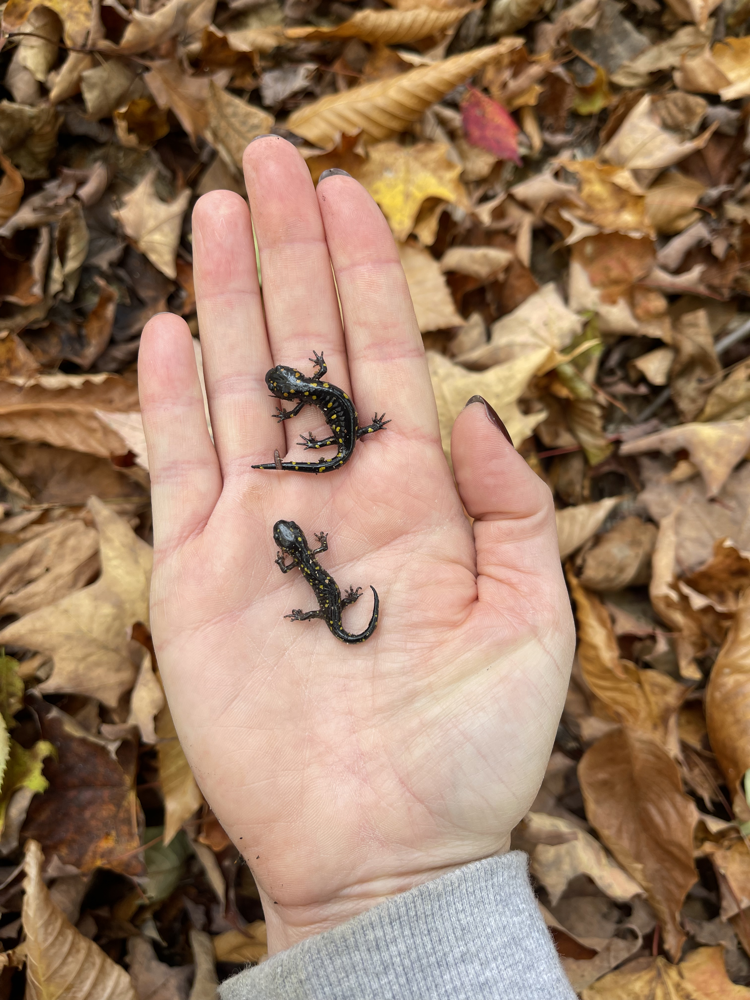

<header class="interior-header">

<nav class="interior-nav">
<a href="research.html">Research</a>
<a href="publications.html">Publications</a>
<a href="people.html">People</a>
<a class="active" href="opportunities.html">Opportunities</a>
<a href="art.html">Art</a>
</nav>

</header>

<main class="research-page">

<section class="research-intro">

Opportunities

</section>

<section class="opportunity-section opportunity-section-with-photo">

  

<h2>Graduate students</h2>

The Chambers Lab is actively recruiting graduate students for Fall 2027! We're looking for students interested in species delimitation, conservation genomics, or landscape genomics. If you're interested, please <a href="https://forms.gle/qudk1D6yHBsGCQnt5" class="text-link">fill out this form</a>. Dr. Chambers will reach out with further questions and if she would like to schedule a virtual interview with you.

The Chambers Lab is in the Department of Biological Sciences at Northern Arizona University. Please see <a href="https://catalog.nau.edu/Catalog/details?plan=BIOPHD" class="text-link">here</a> for information on the PhD program and admission process. In general, prospective students should reach out to Dr. Chambers in the fall. NAU has three application deadlines for grad school: the initial deadline is the beginning of December, followed by a secondary deadline in mid-January, and a final deadline in mid-February. Final candidates will be flown to Flagstaff to visit NAU and the lab in the spring prior to admission decisions.

</section>

<section class="opportunity-section">

<h2>Undergraduate students</h2>

The lab does not currently have any opportunities for undergraduate research. However, Dr. Chambers is always happy to be a sponsoring faculty member for undergrads who would like to write an <a href="https://in.nau.edu/office-undergraduate-research/hooper-undergraduate-research-award/" class="text-link">NAU HURA grant proposal</a> for research ideas of their own; if you're interested in writing a HURA or another proposal for undergraduate research, please email Dr. Chambers with a tentative topic that you're hoping to work on.

We are always looking for volunteers to help out in the <a href="https://in.nau.edu/department-biological-sciences/collections/" class="text-link">NAU Vertebrate Collection</a>. Our collection has ~10,000 fish, bird, reptile, mammal, and amphibian specimens. Volunteering involves helping with accessioning, databasing, organizing, and preparing specimens. If you're interested in volunteering in the collection, please send Dr. Chambers an email describing your interest and your availability during the semester.

</section>

<section class="opportunity-section">

<h2>Postdoctoral researchers</h2>

Although the lab does not currently have funding to support a postdoc, Dr. Chambers invites anyone interested in writing proposals (such as the <a href="https://www.nsf.gov/funding/opportunities/prfb-postdoctoral-research-fellowships-biology" class="text-link">NSF PRFB</a> or the <a href="https://www.smithfellows.org/" class="text-link">Smith Fellows program</a>) to reach out if they are interested in her as a potential sponsor to fund postdoc research in the lab.

</section>

</main>

<footer class="site-footer">

<a href="https://github.com/eachambers">GitHub</a>
<a href="https://scholar.google.com/citations?user=WmEPfsMAAAAJ&hl=en">Google Scholar</a>
<a href="https://bsky.app/profile/chamberea.bsky.social">Bluesky</a>

</footer>