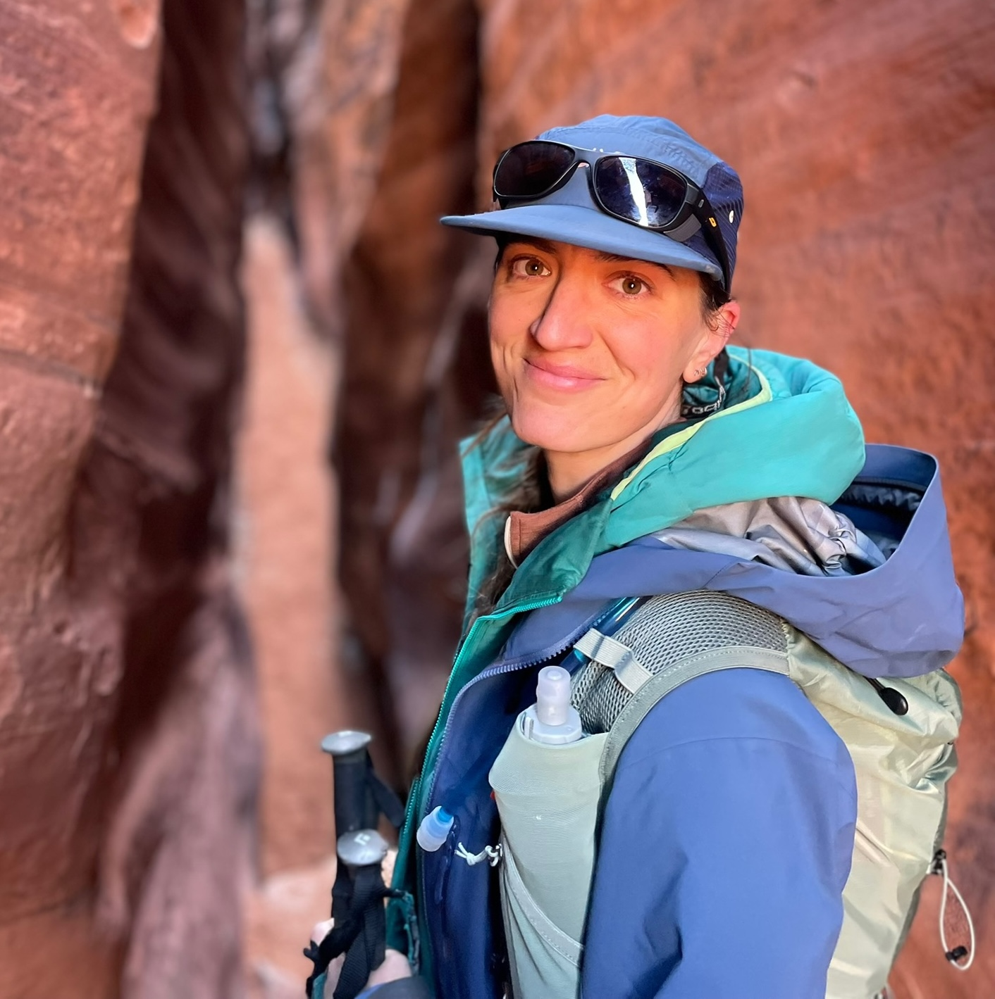
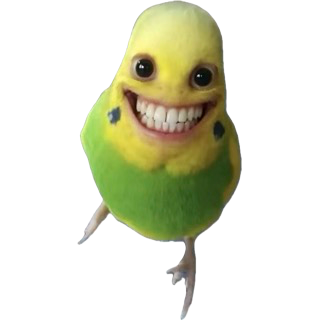
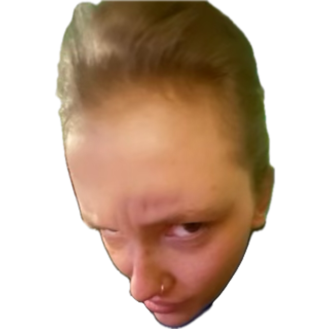
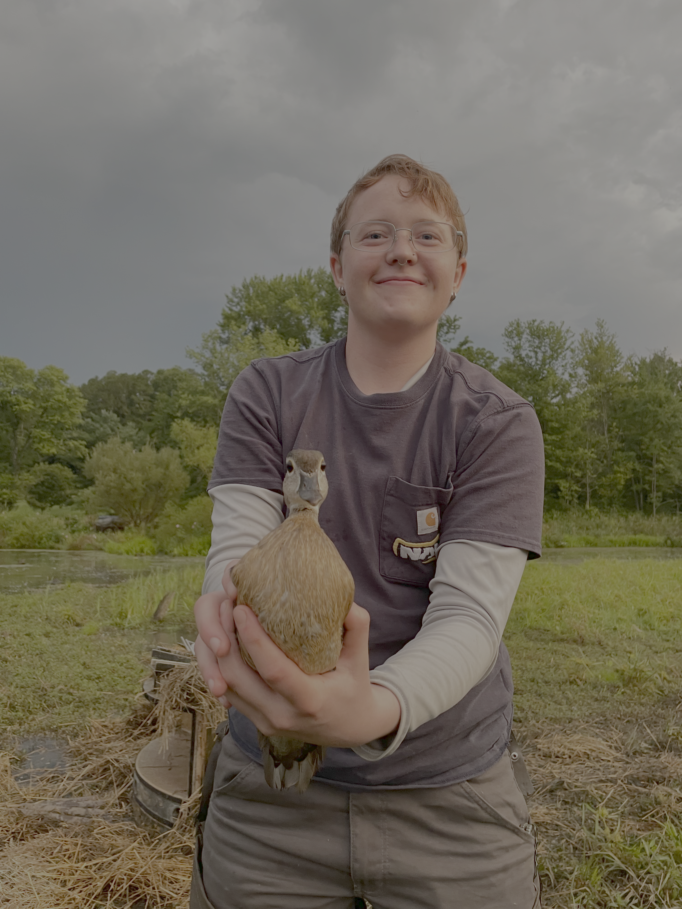

<header class="interior-header">

<nav class="interior-nav">
<a href="research.html">Research</a>
<a href="publications.html">Publications</a>
<a class="active" href="people.html">People</a>
<a href="opportunities.html">Opportunities</a>
<a href="art.html">Art</a>
</nav>

</header>

<main class="people-page">

<section class="people-intro">

People

</section>

<section class="pi-profile">

<h2>E. Anne Chambers</h2>

Principal Investigator

Dr. Chambers received her BSc and MSc from the University of Guelph, her PhD at the University of Texas at Austin, and did her postdoctoral work at the University of California, Berkeley. She's an Assistant Professor in the Department of Biological Sciences and the Curator of NAU's Vertebrate Collection.

<a href="mailto:anne.chambers@nau.edu">Email</a>
<a href="https://scholar.google.com/citations?user=WmEPfsMAAAAJ&hl=en">Google Scholar</a>

</section>

<section class="people-section">

Current Lab Members

<h3>Abbie Brozich</h3>

Undergraduate Researcher

Abbie is interested in...

<h3>Kamryn Crider</h3>

Undergraduate Researcher

Kamryn is interested in...

<h3>Josiah Hankens</h3>

Undergraduate researcher · NAU Vertebrate Collection

Josiah is interested in...

<h3>Kaden O'Sullivan</h3>

Undergraduate researcher

Kaden is interested in...

<h3>Horace the Oryx</h3>

Emotional support taxidermy

</section>

<section class="alumni-section">

Lab Alumni

<h3>Katie Stowers</h3>

Collections Manager

NAU Vertebrate Collection

<h3>Nat Harris</h3>

Undergraduate Volunteer

NAU Vertebrate Collection

</section>

</main>

<footer class="site-footer">

<a href="https://github.com/eachambers">GitHub</a>
<a href="https://scholar.google.com/citations?user=WmEPfsMAAAAJ&hl=en">Google Scholar</a>
<a href="https://bsky.app/profile/chamberea.bsky.social">Bluesky</a>

</footer>