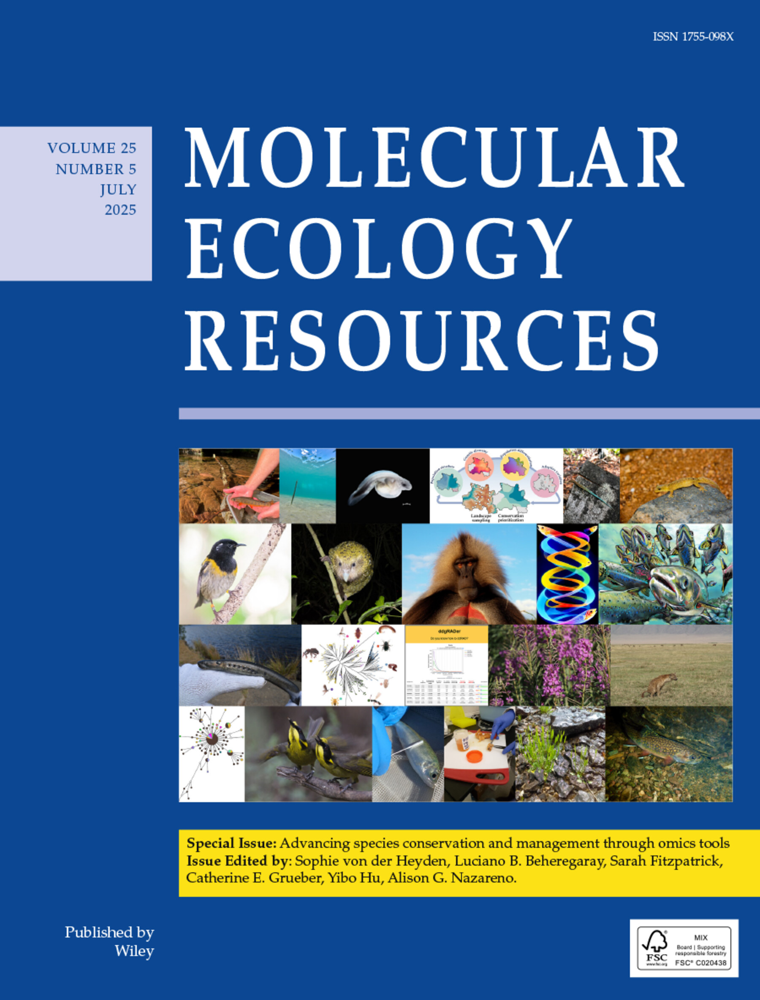
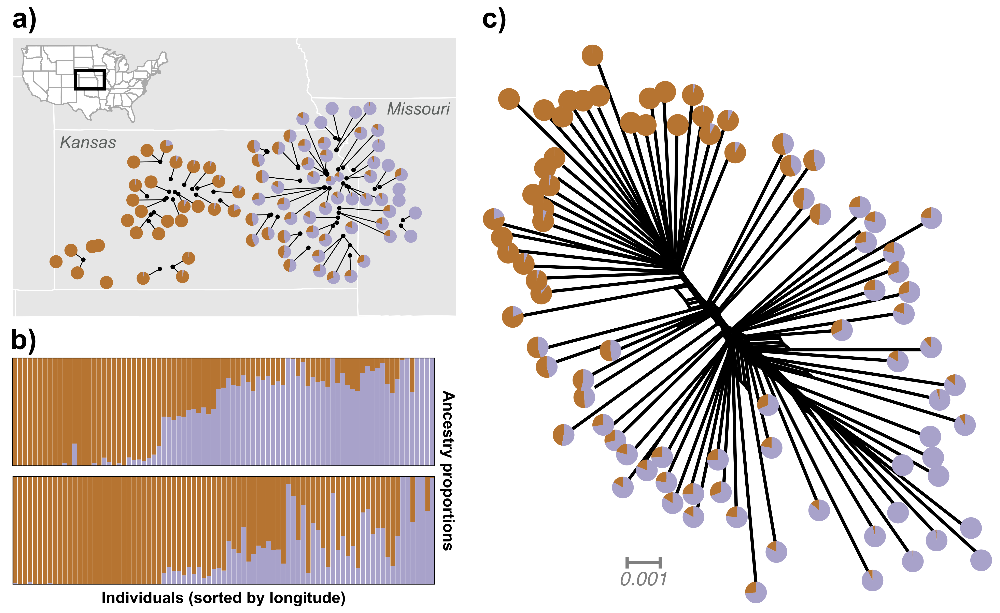
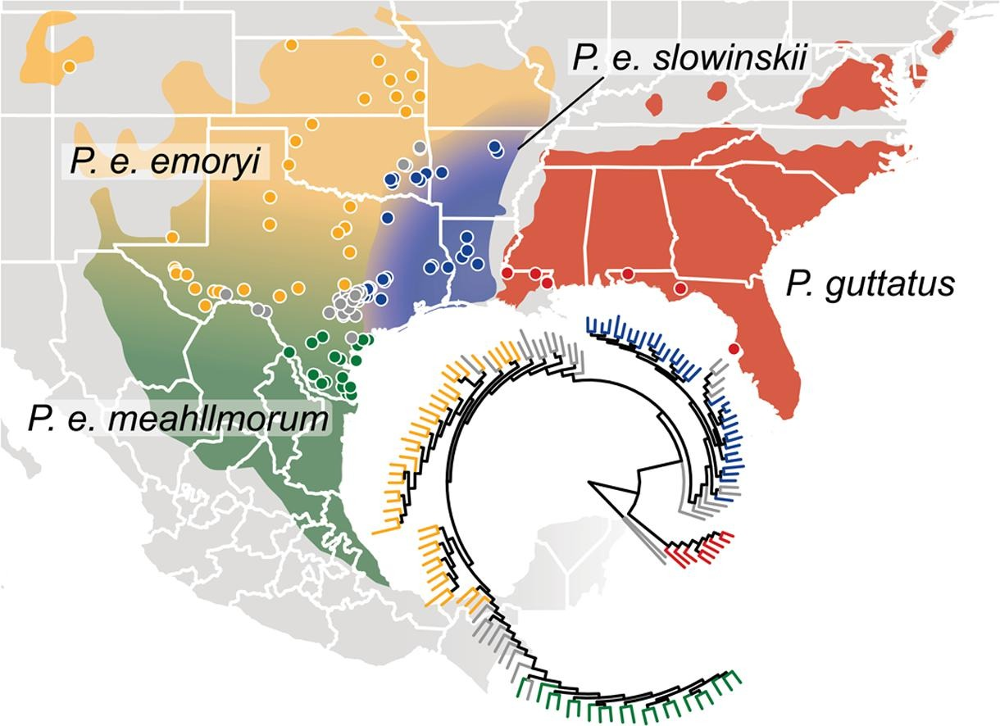

<header class="interior-header">

<nav class="interior-nav">
<a href="research.html">Research</a>
<a class="active" href="publications.html">Publications</a>
<a href="people.html">People</a>
<a href="opportunities.html">Opportunities</a>
<a href="art.html">Art</a>
</nav>

</header>

<main class="publications-page">
<section class="research-intro">

Publications

† Indicates co-first author

<a class="paper-link" href="https://scholar.google.com/citations?user=WmEPfsMAAAAJ&hl=en" target="_blank" rel="noopener">
  Google Scholar
</a>

<section class="publications-list">

  
  
  

<h2 class="publications-subheading">Pre-prints &amp; in review</h2>

Marshall T.L., <strong>Chambers E.A.</strong>, Matz M.V., Havird J.C., &amp; Hillis D.M. (2026) At the mitonuclear crossroads: Introgression and coevolution in the <em>Pantherophis guttatus complex</em>. In revision at <em>Evolution</em>.

<h2 class="publications-subheading">2025</h2>

<strong>Chambers E.A.</strong>, Lara-Tufiño J.D., Campillo-García G., Cisneros-Bernal A.Y., Dudek Jr. D.J., León-Règagnon V., Townsend J.H., Flores-Villela O., & Hillis D.M. (2025) Distinguishing species boundaries from geographic variation. <em>Proceedings of the National Academy of Sciences USA</em> 122(19):e2423688122.
<a class="pub-link" href="https://doi.org/10.1073/pnas.2423688122" target="_blank"
   rel="noopener" aria-label="Open publication">link here</a>

<strong>Chambers E.A.†</strong>, Bishop A.P.†, & Wang I.J. (2025) Individual-based landscape genomics for conservation: an analysis pipeline. <em>Molecular Ecology Resources</em> 25:e13884.
<a class="pub-link" href="https://doi.org/10.1111/1755-0998.13884" target="_blank"
   rel="noopener" aria-label="Open publication">link here</a>

<h2 class="publications-subheading">2023</h2>

<strong>Chambers E.A.</strong>, Marshall T.L., &amp; Hillis D.M. (2023) The importance of contact zones for distinguishing interspecific from intraspecific geographic variation. <em>Systematic Biology</em> 72(2):357–371.
<a class="pub-link" href="https://doi.org/10.1093/sysbio/syac056" target="_blank"
   rel="noopener" aria-label="Open publication">link here</a>

<strong>Chambers E.A.†</strong>, Tarvin R.D.†, Santos J., Ron S., Betancourth M., Hillis D.M., Matz M.V., & Cannatella D.C. (2023) 2b or not 2b? 2bRAD is a low-cost and effective alternative to ddRAD for phylogenomics. <em>Ecology and Evolution</em> 13(3):e9842.
<a class="pub-link" href="https://doi.org/10.1002/ece3.9842" target="_blank"
   rel="noopener" aria-label="Open publication">link here</a>

Bishop A.P., <strong>Chambers E.A.</strong>, & Wang I.J. (2023) Generating continuous maps of genetic diversity using moving windows. <em>Methods in Ecology and Evolution</em> 14(5):1175–1181.
<a class="pub-link" href="https://doi.org/10.1111/2041-210X.14090" target="_blank"
   rel="noopener" aria-label="Open publication">link here</a>

Wu Y.-H., Hou S.-B., Yuan Z.-Y., Jiang K., Wang K., Zhao H.-P., Zhang B.-L., Chen J.-M., Wang L.-J., Stuart B.L., <strong>Chambers E.A.</strong>, Wang Y.-F., Gao W., Zou D.-H., Yan F., Zhou W.-W., Fu Z.-X., Zhang L., Ren J.-L., Liu X.-L., Jin J.-Q., Zhao G.-G., Ying T.-T., Li J.-T., Zhao W.-G., Murphy R.W., Guo P., Huang S., Zhang Y.-P., & Che J. (2023) DNA barcoding of Chinese snakes reveals hidden diversity and conservation needs. <em>Molecular Ecology Resources</em> 23(5):1124–1141.
<a class="pub-link" href="https://doi.org/10.1111/1755-0998.13784" target="_blank"
   rel="noopener" aria-label="Open publication">link here</a>

Velo-Antón G., <strong>Chambers E.A.</strong>, Poyarkov Jr. N., Canestrelli D., Bisconti B., Naumov B., Benéitez M.J.F., Borisenko A., & Martínez-Solano I. (2023) COI barcoding provides reliable species identification and pinpoints cryptic diversity in Western Palearctic amphibians. <em>Amphibia-Reptilia</em> 44(4):399–413.
<a class="pub-link" href="https://doi.org/10.1163/15685381-bja10148" target="_blank"
   rel="noopener" aria-label="Open publication">link here</a>

<h2 class="publications-subheading">2022</h2>

Gao W., Yu C.-X., Zhou W.-W., Zhang B.-L., <strong>Chambers E.A.</strong>, Dahn H.A., Jin J.-Q., Murphy R.W., Zhang Y.-P., & Che J. (2022) Species persistence with hybridization in toad-headed lizards driven by divergent selection and low recombination. <em>Molecular Biology and Evolution</em> 39(4):msac064.
<a class="pub-link" href="https://doi.org/10.1093/molbev/msac064" target="_blank"
   rel="noopener" aria-label="Open publication">link here</a>

<h2 class="publications-subheading">2021</h2>

Hillis D.M., <strong>Chambers E.A.</strong>, & Devitt T.J. (2021) Contemporary methods and evidence for species delimitation. <em>Ichthyology and Herpetology</em> 109(3):895–903.
<a class="pub-link" href="https://doi.org/10.1643/h2021082" target="_blank"
   rel="noopener" aria-label="Open publication">link here</a>

Marshall T.L., <strong>Chambers E.A.</strong>, Matz M.V., & Hillis D.M. (2021) How mitonuclear discordance and geographic variation have confounded species boundaries in a widely studied snake. <em>Molecular Phylogenetics and Evolution</em> 162:107194.
<a class="pub-link" href="https://doi.org/10.1016/j.ympev.2021.107194" target="_blank"
   rel="noopener" aria-label="Open publication">link here</a>

<h2 class="publications-subheading">2020</h2>

<strong>Chambers E.A.</strong> & Hillis D.M. (2020) The multispecies coalescent over-splits species in the case of geographically widespread taxa. <em>Systematic Biology</em> 69(1):184–193.
<a class="pub-link" href="https://doi.org/10.1093/sysbio/syz042" target="_blank"
   rel="noopener" aria-label="Open publication">link here</a>

<h2 class="publications-subheading">2016</h2>

<strong>Chambers E.A.</strong> & Hebert P.D.N. (2016) Assessing DNA barcodes for species identification in North American reptiles and amphibians in natural history collections. <em>PLOS ONE</em> 11(4): e0154363.
<a class="pub-link" href="https://doi.org/10.1371/journal.pone.0154363" target="_blank"
   rel="noopener" aria-label="Open publication">link here</a>

</main>

<footer class="site-footer">

<a href="https://github.com/eachambers">GitHub</a>
<a href="https://scholar.google.com/citations?user=WmEPfsMAAAAJ&hl=en">Google Scholar</a>
<a href="https://bsky.app/profile/chamberea.bsky.social">Bluesky</a>

</footer>