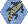

<header class="interior-header">

<nav class="interior-nav">
<a class="active" href="research.html">Research</a>
<a href="publications.html">Publications</a>
<a href="people.html">People</a>
<a href="opportunities.html">Opportunities</a>
<a href="art.html">Art</a>
</nav>

</header>

<main class="research-page">

<section class="research-intro">

Research

</section>

<section class="field-note">

Field Note 01.

<h2>How do we recognize species in a continuum of variation?</h2>

Species form along a continuum, making the boundary between variation within species and divergence among species surprisingly difficult to define. We study how genomic data and model-based approaches can help us understand and delimit species, with a particular emphasis on contact zones: places where divergent lineages meet, exchange genes, and provide natural tests of species boundaries.

<a href="https://doi.org/10.1073/pnas.2423688122" class="paper-link">Chambers et al. (2025)</a>
<a href="https://doi.org/10.1093/sysbio/syac056" class="paper-link">Chambers et al. (2023)</a>
<a href="https://doi.org/10.1093/sysbio/syz042" class="paper-link">Chambers &amp; Hillis (2020)</a>

</section>

<section class="field-note">

Field Note 02.

<h2>How can we conserve biodiversity in a rapidly changing world?</h2>

Genetic variation shapes the capacity of populations to respond to environmental change, but both adaptive variation and evolutionary potential are unevenly distributed across landscapes. We combine large-scale genomic datasets with environmental and spatial information to understand where genetic diversity occurs, how populations are connected, and how well they may be able to respond to future change. Ultimately, we aim to translate these patterns into conservation strategies that preserve both current biodiversity and its capacity to adapt.

<a href="https://doi.org/10.1111/1755-0998.13884" class="paper-link">Chambers et al. (2025)</a>

</section>

<section class="field-note">

Field Note 03.

<h2>What can the past tell us about biodiversity today?</h2>

Natural history collections preserve biological information across places and through time, allowing us to ask questions that were unimaginable when many specimens were first collected. We curate the NAU Vertebrate Collection as both a record of biodiversity and an active resource for modern research, teaching, and community engagement, while working to ensure that specimens collected today remain available to answer the questions of the future.

</section>

<section class="software-section">

Tools &amp; Software

<h2>New questions require new tools.</h2>

Answering complex questions about biodiversity often requires developing new analytical approaches. We build open-source software and computational tools for analyzing genomic and spatial data, with an emphasis on making methods accessible, reproducible, and useful to the broader research and conservation communities.

<h3>algatr.</h3>

An R package providing streamlined workflows for landscape genomic analyses.

<a href="https://doi.org/10.1111/1755-0998.13884">Documentation</a>
<a href="https://github.com/TheWangLab/algatr">GitHub</a>
<a href="https://github.com/TheWangLab/algatr_workshop">Workshop</a>

<h3>wingen.</h3>

An R package for mapping genetic diversity using moving windows.

<a href="http://doi.org/10.1111/2041-210X.14090">Documentation</a>
<a href="https://github.com/AnushaPB/wingen">GitHub</a>
<a href="https://cran.r-project.org/web/packages/wingen/index.html">CRAN</a>

</section>

</main>

<footer class="site-footer">

<a href="https://github.com/eachambers">GitHub</a>
<a href="https://scholar.google.com/citations?user=WmEPfsMAAAAJ&hl=en">Google Scholar</a>
<a href="https://bsky.app/profile/chamberea.bsky.social">Bluesky</a>

</footer>